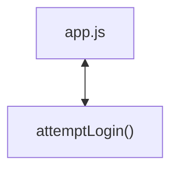

# Codebase Architectural Report

> **Auto-generated** by graphify knowledge graph analysis  
> **Purpose**: Dependency map, connection analysis, subsystem breakdown, and quality hotspots.

---

## 1. Executive Summary

- **Total Components**: `2`
- **Total Connections**: `1`
- **Subsystem Modules**: `1`
- **Dependency Types**: `1`

**Key Architectural Hubs:**

| # | Component | File | Type | Connections |
|---|-----------|------|------|-------------|
| 1 | `app.js` | `app.js` | file | 1 |
| 2 | `attemptLogin()` | `app.js` | method | 1 |

---

## 2. Dependency & Connection Analysis

### Relationship Types

| Relationship | Count | Share |
|-------------|-------|-------|
| `contains` | 1 | 100% |

### Hub Dependency Diagram

### Most Connected Pairs

| Component A | Component B | Shared Connections |
|-------------|-------------|-------------------|
| `app.js` | `attemptLogin()` | 1 |

---

## 3. Subsystem & Module Breakdown

### 3.1 app.js
**Nodes**: `2`  
**Files**: `app.js`

| Component | Type | File | Connections |
|-----------|------|------|-------------|
| `app.js` | file | `app.js` | 1 |
| `attemptLogin()` | method | `app.js` | 1 |

---

## 4. API Reference

Public classes and functions by subsystem.

---

## 5. Code Quality & Architectural Risk Hotspots

### Component Type Distribution

| Type | Count | Share |
|------|-------|-------|
| file | 1 | 50% |
| method | 1 | 50% |

### Dependency Cycles

No circular dependencies detected.

### Orphaned Components

No orphaned components detected.

---

## 6. How to Navigate

1. **Interactive D3 Map** — open `graph.html` to explore node connections visually.
2. **Knowledge Graph Queries** — use MCP tools (`graph_query`, `graph_explain_node`, `graph_impact_radius`).
